# NeoForge-Alpha: Mod-Architektur & Klassendesign

Dieses Dokument beschreibt die Architektur, Datenflüsse und Klassenhierarchien des Spaceship- und Schutzschildsystems für **Minecraft 1.21 (NeoForge)** inklusive der Lifecycle- und Concurrency-Absicherungen aus `plan2`.

---

## 1. Architektur-Übersicht & Design-Prinzipien

Das System folgt einer strikten **MVC-/Service-Architektur** mit vollständiger Trennung zwischen logischem Server und Client:

* **Server (Domain & Services)**: Hält die Autorität über alle Schiffe (`ShipState`), persistiert nur echte Daten (`ShipSavedData`) und delegiert rechenintensive Aufgaben (Schild-Dilatation) an Java 21 Virtual Threads (`ShipMorphologyService`) mit unmodifizierbaren Snapshots (`getImmutableBlockSnapshot()`). Bewegungsoperationen nutzen ein Time-Slicing Tick-Budget (`ShipMovementService`) mit automatischem Chunk-Forceloading via Region-Tickets (`TicketType`).
* **Network (Typisierte Payloads & Thread-Safety)**: Alle Netzwerkinteraktionen nutzen moderne `CustomPacketPayload`-Records mit deklarativen `StreamCodec`-Definitionen. Client-Payloads werden strikt über `context.enqueueWork()` auf dem Render-Main-Thread ausgeführt.
* **Spatial Hashing & Lifecycle-Sync**: Schilde und Strukturdaten werden bei Chunk-Load abgeglichen. Falls Chunks auf dem Client noch nicht geladen sind, puffert `ClientShipManager` die Pakete in einer Pending-Queue (`PENDING_SYNCS`) und wendet sie bei `ChunkEvent.Load` verzögerungsfrei an.
* **Client (View Model & VRAM Lifecycle)**: Der Client verwaltet seine Sicht auf Schiffe im `ClientShipManager` und rendert Schilde über VBOs (`VertexBuffer`) im `ClientShipState`. Beim Entladen von Chunks (`ChunkEvent.Unload`) oder Logout werden VRAM-Buffer über `RenderSystem.recordRenderCall()` bzw. `dispose()` sofort freigegeben, um Memory Leaks zu verhindern.

---

## 2. Detailliertes Mermaid Klassendiagramm

```mermaid
classDiagram
    direction TB

    %% ==========================================
    %% SERVER SIDE DOMAIN & SERVICES
    %% ==========================================
    namespace Server_Side {
        class ISpaceshipNode {
            <<interface>>
            +getShipId() UUID
            +setShipId(UUID shipId) void
            +getShip() ShipState
        }

        class AbstractSpaceshipNodeBlockEntity {
            <<abstract>>
            +getShipId() UUID
            +setShipId(UUID shipId) void
            +getUpdateTag(Provider registries) CompoundTag
            +getUpdatePacket() ClientboundBlockEntityDataPacket
        }

        class ModAttachments {
            +Supplier~AttachmentType~UUID~~ SHIP_ID
            +register(IEventBus bus) void
        }

        class ShipState {
            -UUID id
            -BlockPos controllerPos
            -Set~BlockPos~ blocks
            -Map~String, BlockPos~ homes
            -List~BlockPos~ reactors
            -List~BlockPos~ shields
            -boolean isShieldActive
            +getId() UUID
            +getControllerPos() BlockPos
            +setControllerPos(BlockPos pos) void
            +getBlocks() Set~BlockPos~
            +getImmutableBlockSnapshot() Set~BlockPos~
            +setBlocks(Set~BlockPos~ blocks, Level level) void
            +isShieldActive() boolean
            +setShieldActive(boolean active) void
            +toggleShieldActive() void
            +syncShieldBubbleToClients(Level level) void
        }

        class ServerShipManager {
            +Map~UUID, ShipState~ ACTIVE_SHIPS$
            +getShip(UUID shipId)$ ShipState
            +hasShip(UUID shipId)$ boolean
            +createShip(Level level, BlockPos startPos)$ ShipState
            +updateShipBlocks(Level level, ShipState ship)$ void
            +deleteShip(Level level, ShipState ship)$ void
            +saveData(Level level)$ void
            +onServerStarted(ServerStartedEvent event)$ void
            +onChunkSent(ChunkWatchEvent.Sent event)$ void
        }

        class ShipSavedData {
            +get(ServerLevel level)$ ShipSavedData
            +save(CompoundTag tag, Provider registries) CompoundTag
            +load(CompoundTag tag, Provider registries)$ ShipSavedData
        }

        class ShipScannerService {
            +MAX_SHIP_BLOCKS int$
            +scan(Level level, BlockPos startPos)$ Set~BlockPos~
        }

        class ShipMorphologyService {
            +calculateShieldBubbleAsync(Set~BlockPos~ shipBlocks, int radius)$ CompletableFuture~Set~BlockPos~~
            +performVolumetricDilation(Set~BlockPos~ immutableBlocks, int radius)$ Set~BlockPos~
            +calculateAndSyncShieldAsync(ShipState ship, ServerLevel level, int radius)$ void
        }

        class ShipMovementService {
            +TICK_BUDGET_NANOS long$
            +SHIP_TICKET TicketType~ChunkPos~$
            -Queue~MovementTask~ PENDING_TASKS$
            +moveShip(Level level, ShipState ship, int dx, int dy, int dz, Player player)$ void
            +prepareDestinationChunks(ServerLevel level, ShipState ship, Vec3 movementVector)$ Set~ChunkPos~
            +releaseDestinationChunks(ServerLevel level, Set~ChunkPos~ loadedChunks)$ void
            +onServerTick(ServerTickEvent.Post event)$ void
        }

        class SpaceshipEnergyManager {
            +tryConsumeFlightEnergy(Level level, ShipState ship, int dx, int dy, int dz, Player player)$ boolean
            +tryConsumeEnergyAmount(Level level, ShipState ship, int amount)$ boolean
        }

        class SpaceshipNavigationManager {
            +saveHome(Level level, ShipState ship, String homeName)$ void
            +teleportToHome(Level level, ShipState ship, String homeName, Player player)$ void
        }

        class SpaceshipShieldHandler {
            +ENERGY_COST_PER_BLOCK int$
            +onBlockBreak(BreakEvent event)$ void
            +onExplosion(ExplosionEvent.Detonate event)$ void
        }
    }

    %% ==========================================
    %% NETWORK LAYER
    %% ==========================================
    namespace Network_Layer {
        class ModPayloads {
            +register(IEventBus bus)$ void
        }

        class ShipActionPayload {
            <<record>>
            +ActionType actionType
            +Optional~UUID~ shipId
            +BlockPos pos
            +int value
            +String targetName
        }

        class ShipStructureSyncPayload {
            <<record>>
            +UUID shipId
            +BlockPos controllerPos
            +Set~BlockPos~ relativeBlocks
        }

        class ShipStateSyncPayload {
            <<record>>
            +UUID shipId
            +int currentEnergy
            +boolean isShieldActive
        }

        class ShieldBubbleSyncPacket {
            <<record>>
            +UUID shipId
            +BlockPos anchorPos
            +Set~BlockPos~ relativeBubbleBlocks
        }

        class ShipPositionSyncPayload {
            <<record>>
            +UUID shipId
            +BlockPos newAnchorPos
        }

        class ServerPayloadHandler {
            +handleAction(ShipActionPayload payload, IPayloadContext context)$ void
        }

        class ClientPayloadHandler {
            +handleShieldBubbleSync(ShieldBubbleSyncPacket packet, IPayloadContext context)$ void
            +handleStructureSync(ShipStructureSyncPayload packet, IPayloadContext context)$ void
            +handleStateSync(ShipStateSyncPayload packet, IPayloadContext context)$ void
            +handlePositionSync(ShipPositionSyncPayload packet, IPayloadContext context)$ void
        }
    }

    %% ==========================================
    %% CLIENT SIDE VIEW & RENDERING
    %% ==========================================
    namespace Client_Side {
        class ClientShipState {
            -UUID shipId
            -BlockPos anchorPos
            -Set~BlockPos~ relativeBubbleBlocks
            -Set~BlockPos~ relativeStructureBlocks
            -VertexBuffer shieldMesh
            -boolean isShieldActive
            -boolean isDisposed
            -Vec3 lastImpactPos
            -float shieldEnergyPercentage
            -long lastImpactTick
            +getShipId() UUID
            +getAnchorPos() BlockPos
            +setAnchorPos(BlockPos pos) void
            +getShieldMesh() VertexBuffer
            +isShieldActive() boolean
            +isDisposed() boolean
            +updateMesh(Set~BlockPos~ relativeBlocks) void
            +dispose() void
            +close() void
        }

        class ClientShipManager {
            -Map~UUID, ClientShipState~ ACTIVE_CLIENT_SHIPS$
            -Map~ChunkPos, List~ShieldBubbleSyncPacket~~ PENDING_SYNCS$
            +getOrCreateShip(UUID shipId)$ ClientShipState
            +getShip(UUID shipId)$ ClientShipState
            +getAllShips()$ Collection~ClientShipState~
            +updateShieldBubble(UUID id, BlockPos anchor, Set~BlockPos~ bubble)$ void
            +updateShipStructure(UUID id, BlockPos anchor, Set~BlockPos~ structure)$ void
            +updateShipState(UUID id, int energy, boolean active)$ void
            +addPendingSync(ShieldBubbleSyncPacket packet)$ void
            +removeShip(UUID id)$ void
            +clear()$ void
            +onClientChunkLoad(ChunkEvent.Load event)$ void
            +onClientChunkUnload(ChunkEvent.Unload event)$ void
            +onClientLoggingOut(LoggingOut event)$ void
        }

        class ShieldRenderer {
            +renderShields(PoseStack stack, MultiBufferSource buffer, Camera camera, float partialTicks)$ void
            +buildShieldMesh(Set~BlockPos~ bubbleBlocks)$ MeshData
        }

        class AbstractSpaceshipScreen {
            <<abstract>>
            #sendShipAction(ActionType type) void
            #sendShipAction(ActionType type, int val, String target) void
        }

        class SpaceshipControlScreen {
            +init() void
            +render(GuiGraphics graphics, int mouseX, int mouseY, float partialTick) void
        }

        class SpaceshipHelmScreen {
            +init() void
            +render(GuiGraphics graphics, int mouseX, int mouseY, float partialTick) void
        }
    }

    %% ==========================================
    %% RELATIONSHIPS & DEPENDENCIES
    %% ==========================================
    AbstractSpaceshipNodeBlockEntity ..|> ISpaceshipNode : implements
    AbstractSpaceshipNodeBlockEntity ..> ModAttachments : uses AttachmentType
    ServerShipManager o-- "0..*" ShipState : manages
    ServerShipManager ..> ShipSavedData : persists via
    ServerShipManager ..> ShipScannerService : scans with
    ShipState ..> ShipMorphologyService : requests async calculation (Immutable Snapshot)
    ServerShipManager ..> ShipMovementService : time-sliced mover with chunk tickets
    SpaceshipNavigationManager ..> ShipMovementService : delegates travel
    SpaceshipNavigationManager ..> ServerShipManager : saves waypoint

    %% Server to Network
    ServerShipManager ..> ShipStructureSyncPayload : dispatches (Spatial Hashing)
    ServerShipManager ..> ShipStateSyncPayload : dispatches (Delta Telemetry)
    ShipMorphologyService ..> ShieldBubbleSyncPacket : dispatches
    ServerPayloadHandler ..> ServerShipManager : invokes CRUD
    ServerPayloadHandler ..> ShipMovementService : invokes movement

    %% Network to Client
    ClientPayloadHandler ..> ClientShipManager : updates (enqueued to Main Thread)
    ClientShipManager *-- "0..*" ClientShipState : contains
    ClientShipState o-- "0..1" VertexBuffer : owns (VRAM)
    ShieldRenderer ..> ClientShipManager : reads view models

    %% UI to Network
    AbstractSpaceshipScreen <|-- SpaceshipControlScreen : extends
    AbstractSpaceshipScreen <|-- SpaceshipHelmScreen : extends
    AbstractSpaceshipScreen ..> ShipActionPayload : sends to server
```

---

## 3. Datenfluss & Lebenszyklus-Matrix

| Aktion | Auslöser / Schicht | Ausführung | Netzwerk / Persistenz |
| :--- | :--- | :--- | :--- |
| **Schiff registrieren** | Spieler klickt UI `CREATE` | `ServerPayloadHandler` -> `ServerShipManager.createShip()` | Scan via `ShipScannerService`, UUID-Attachment via `ModAttachments.SHIP_ID`, Speichern via `ShipSavedData.setDirty()`. |
| **Schild-Berechnung** | Schildblock platziert / Scan | `ShipState.syncShieldBubbleToClients()` -> `ShipMorphologyService` | Erstellt `getImmutableBlockSnapshot()`, berechnet asynchron auf Java 21 **Virtual Threads**, sendet `ShieldBubbleSyncPacket` thread-sicher via Server-Main-Thread. |
| **Schild-Rendering** | Render-Frame (Client) | `ShieldRenderer.renderShields()` | Liest ausschließlich aus `ClientShipManager` / `ClientShipState.getShieldMesh()` (direkter VRAM VBO Zugriff). |
| **Näherungs-Sync & Chunk-Handling** | Chunk lädt für Spieler | `ClientPayloadHandler` -> `ClientShipManager` | Falls Chunk geladen: Mesh sofort gebaut. Falls nicht geladen: In `PENDING_SYNCS` gepuffert und bei `ChunkEvent.Load` angewendet. |
| **VRAM Freigabe** | Chunk entlädt / Ship zerstört | `ClientShipManager.onClientChunkUnload()` | Ruft `ClientShipState.dispose()`, schließt VBO über `RenderSystem.recordRenderCall()` sofort im Render-Kontext. |
| **Schiffsbewegung & Forceloading** | Spieler steuert Schiff | `ShipMovementService.moveShip()` | Forceloaded Ziel-Chunks mit `SHIP_TICKET`, rechnet im `ServerTickEvent.Post` mit max. **10ms Tick-Budget** pro Tick und gibt Tickets nach Abschluss wieder frei. |
