# NeoForge-Alpha: Mod-Architektur & Klassendesign

Dieses Dokument beschreibt die Architektur, Datenflüsse, Klassenhierarchien und mathematischen Modelle des Spaceship-, Schutzschild- und Raumkampf-Systems für **Minecraft 1.21 (NeoForge)** inklusive aller Concurrency-, Lifecycle- und Edge-Case-Absicherungen.

---

## 1. Architektur-Übersicht & Design-Prinzipien

Das Gesamtsystem folgt einer strikten **Model-View-Controller (MVC) / Service-Architektur** mit vollständiger Entkopplung zwischen logischem Server und Client:

1. **Server (Domain & Authoritative Services)**:
   * Hält die alleinige Autorität über alle Schiffe (`ShipState`), persistiert ausschließlich reine Domain-Daten (`ShipSavedData`) und berechnet komplexe Schiffsgeometrien asynchron oder zeitbegrenzt.
   * **Kampf- & Raycast-Mathematik (`com.peaceman.alpha.ship.combat.*`)**: Nutzt den **Amanatides-and-Woo 3D-DDA-Algorithmus** (`FastVoxelTraversal`) in Kombination mit einer zweistufigen Broadphase-/Narrowphase-Filterung (`LaserRaycastUtil`), um Strahlen kollisionsgenau in $O(\text{Ray-Länge})$ anstelle von $O(\text{Blockanzahl})$ zu berechnen.
   * **Time-Sliced Mover (`ShipMovementService`)**: Führt translatorische Schiffsbewegungen mit einem festen **10ms Tick-Budget** pro Server-Tick aus und forceloaded Ziel-Chunks via `TicketType` (`SHIP_TICKET`).
2. **Network (Deklarative StreamCodecs & Thread-Safety)**:
   * Alle Netzwerkinteraktionen sind als unveränderliche `CustomPacketPayload`-Records mit Mojang/NeoForge `StreamCodec`-Composites implementiert.
   * Client-Payloads werden strikt über `context.enqueueWork()` auf dem Render-Main-Thread synchronisiert.
3. **Spatial Hashing & Lifecycle-Synchronisation**:
   * Struktur- und Schilddaten werden via `ChunkWatchEvent.Sent` gezielt nur an Spieler gestreamt, die den entsprechenden Chunk laden.
   * Wenn Chunks clientseitig noch nicht geladen sind, puffert `ClientShipManager` die Pakete in einer Queue (`PENDING_SYNCS`) und wendet sie bei `ChunkEvent.Load` verzögerungsfrei an.
4. **Client (View Model, Predictive State & VRAM-Management)**:
   * Verwaltet Client-Sichten in `ClientShipManager` und `ClientLaserState`.
   * **Laserstrahlen-Rendering (`LaserBeamRenderer`)**: Rendert volumetrisch leuchtende Billboard-Strahlen mit additiver Farbüberlagerung (`GL_ONE`) und führt Client-Side-Surface-Clipping (`level.clip`) aus, sodass Strahlen exakt auf der Blockoberfläche terminieren.
   * **Translations-Invarianz**: Kontinuierliche Laserstrahlen werden über relative Voxel-Offsets (`shooterShipId + "_" + relativePos.asLong()`) verwaltet, wodurch sie vor, während und nach Schiffsbewegungen absolut synchron bleiben.
   * **VRAM-Freigabe**: Bei Chunk-Entladungen (`ChunkEvent.Unload`), Schiffsauflösung oder Logout werden VBOs und Laserstrahlen sofort freigegeben (`dispose()`).

---

## 2. Vollständiges Mermaid-Klassendiagramm

```mermaid
classDiagram
    direction TB

    %% ==========================================
    %% SERVER SIDE DOMAIN & SERVICES
    %% ==========================================
    namespace Server_Side {
        class ISpaceshipNode {
            <<interface>>
            +getShipId() UUID
            +setShipId(UUID shipId) void
            +getShip() ShipState
        }

        class AbstractSpaceshipNodeBlockEntity {
            <<abstract>>
            +getShipId() UUID
            +setShipId(UUID shipId) void
        }

        class AbstractLaserNodeBlockEntity {
            <<abstract>>
            +getTier() LaserWeaponTier
            +isContinuous() boolean
            +getFacing() Direction
            +getCurrentDrillPos() BlockPos
            +getDrillProgress() float
            +addDrillProgress(float amount) void
            +resetDrillProgress() void
            +clearDrillProgress(Level level) void
            +serverTick(Level level, BlockPos pos, BlockState state)* void
        }

        class PulseLaserBlockEntity {
            -int cooldownRemaining
            +canFire() boolean
            +triggerCooldown() void
        }

        class HeavyBeamBlockEntity {
            -boolean isFiring
            +isFiring() boolean
            +setFiring(boolean firing) void
        }

        class MiningLaserBlockEntity {
            -boolean isMining
            +isMining() boolean
            +setMining(boolean mining) void
        }

        class ModAttachments {
            +Supplier~AttachmentType~UUID~~ SHIP_ID$
            +register(IEventBus bus)$ void
        }

        class ShipState {
            -UUID id
            -BlockPos controllerPos
            -Set~BlockPos~ blocks
            -Map~String, BlockPos~ homes
            -List~BlockPos~ reactors
            -List~BlockPos~ shields
            -List~BlockPos~ weapons
            -boolean isShieldActive
            -ResourceKey~Level~ dimension
            -boolean isJumping
            -long shieldCooldownUntil
            -long movementCooldownUntil
            -VoxelGridCache hullVoxelCache
            -VoxelGridCache shieldVoxelCache
            +getImmutableBlockSnapshot() Set~BlockPos~
            +setBlocks(Set~BlockPos~ blocks, Level level) void
            +recalculateHullBounds() void
            +isInsideHull(BlockPos pos) boolean
            +isInsideShield(BlockPos pos) boolean
            +isShieldOnCooldown(long gameTime) boolean
            +isMovementOnCooldown(long gameTime) boolean
        }

        class ServerShipManager {
            +Map~UUID, ShipState~ ACTIVE_SHIPS$
            +Map~ResourceKey~Level~, Map~UUID, ShipState~~ SHIPS_BY_DIMENSION$
            +getShip(UUID shipId)$ ShipState
            +hasShip(UUID shipId)$ boolean
            +getShipsInDimension(ResourceKey~Level~ dim)$ Map~UUID, ShipState~
            +registerShip(ShipState ship)$ void
            +unregisterShip(ShipState ship)$ void
            +changeShipDimension(Level level, ShipState ship, ResourceKey~Level~ newDim)$ void
            +createShip(Level level, BlockPos startPos)$ ShipState
            +updateShipBlocks(Level level, ShipState ship)$ void
            +deleteShip(Level level, ShipState ship)$ void
            +saveData(Level level)$ void
            +onServerStarted(ServerStartedEvent event)$ void
            +onChunkSent(ChunkWatchEvent.Sent event)$ void
        }

        class ShipTeleportationService {
            +teleportShip(ServerLevel originLevel, ServerLevel targetLevel, ShipState ship, BlockPos targetPos, Player initiator)$ boolean
        }

        class ModDimensions {
            +ResourceKey~Level~ SPACE_LEVEL$
            +ResourceKey~DimensionType~ SPACE_DIM_TYPE$
            +ResourceKey~Biome~ SPACE_BIOME$
            +ResourceKey~NoiseGeneratorSettings~ SPACE_NOISE_SETTINGS$
            +ResourceKey~LevelStem~ SPACE_STEM$
        }

        class SpaceEnvironmentService {
            +onEntityTick(EntityTickEvent.Pre event)$ void
            +isProtectedFromVacuum(LivingEntity entity)$ boolean
        }

        class AsteroidFeature {
            +place(FeaturePlaceContext context) boolean
        }

        class SpaceWreckFeature {
            +place(FeaturePlaceContext context) boolean
        }

        class ShipSavedData {
            +get(ServerLevel level)$ ShipSavedData
            +save(CompoundTag tag, Provider registries) CompoundTag
            +load(CompoundTag tag, Provider registries)$ ShipSavedData
        }

        class LaserCombatService {
            +fireWeapon(Level level, ShipState shooter, BlockPos weaponPos)$ boolean
            +tickContinuousWeapon(Level level, ShipState shooter, BlockPos pos, AbstractLaserNodeBE be)$ void
            -processPulseHit(Level level, ShipState shooter, LaserWeaponTier tier, RaycastHitResult hit)$ void
            -processContinuousHit(Level level, ShipState shooter, BlockPos pos, AbstractLaserNodeBE be, LaserWeaponTier tier, RaycastHitResult hit)$ void
            -destroyShipHullBlock(Level level, ShipState targetShip, BlockPos hitBlock, Vec3 worldHitPos)$ void
        }

        class LaserRaycastUtil {
            +raycast(Level level, UUID shooterId, Vec3 origin, Vec3 dir, double maxRange, boolean hitTerrain)$ RaycastHitResult
        }

        class FastVoxelTraversal {
            +traverse(VoxelGridCache cache, Vec3 localOrigin, Vec3 localDir, double maxDistance)$ Optional~VoxelHit~
        }

        class LaserWeaponTier {
            <<enum>>
            PULSE_LASER
            HEAVY_BEAM
            MINING_LASER
            +getMaxRange() double
            +getEnergyCost() int
            +getBaseDamage() float
            +getCooldownTicks() int
        }

        class RaycastHitResult {
            <<record>>
            +HitType type
            +UUID hitShipId
            +BlockPos relativeBlockPos
            +BlockPos worldBlockPos
            +Vec3 worldHitPos
            +Direction hitFace
            +double distance
            +isHit() boolean
            +isShipHit() boolean
        }

        class VoxelGridCache {
            +BlockPos minOffset
            +BitSet bitSet
            +isSet(int x, int y, int z) boolean
            +buildFromAbsolute(Collection~BlockPos~ abs, BlockPos ctrl)$ VoxelGridCache
        }

        class ShipMovementService {
            +TICK_BUDGET_NANOS long$
            +SHIP_TICKET TicketType~ChunkPos~$
            +moveShip(Level level, ShipState ship, int dx, int dy, int dz, Player player)$ void
            +isShipMoving(UUID shipId)$ boolean
            +onServerTick(ServerTickEvent.Post event)$ void
        }

        class SpaceshipEnergyManager {
            +calculateMovementCost(ShipState ship, int dx, int dy, int dz)$ int
            +getTotalAvailableEnergy(Level level, ShipState ship)$ int
            +consumeEnergy(Level level, ShipState ship, int amount)$ void
            +tryConsumeEnergyAmount(Level level, ShipState ship, int amount)$ boolean
            +tryConsumeFlightEnergy(Level level, ShipState ship, int dx, int dy, int dz, Player player)$ boolean
        }
    }

    %% ==========================================
    %% NETWORK LAYER
    %% ==========================================
    namespace Network_Layer {
        class ModPayloads {
            +register(IEventBus bus)$ void
        }

        class ShipCombatActionPayload {
            <<record>>
            +UUID shipId
            +CombatAction action
        }

        class LaserFirePayload {
            <<record>>
            +UUID shooterShipId
            +Vec3 startPos
            +Vec3 endPos
            +LaserWeaponTier tier
        }

        class LaserStateSyncPayload {
            <<record>>
            +UUID shooterShipId
            +BlockPos weaponPos
            +boolean isFiring
            +LaserWeaponTier tier
        }

        class ShipStructureDeltaPayload {
            <<record>>
            +UUID shipId
            +List~BlockPos~ removedBlocks
        }

        class ShipPositionSyncPayload {
            <<record>>
            +UUID shipId
            +BlockPos newAnchorPos
        }

        class ShipStateSyncPayload {
            <<record>>
            +UUID shipId
            +int currentEnergy
            +boolean isShieldActive
            +long shieldCooldownRemainingTicks
            +long movementCooldownRemainingTicks
        }

        class ServerPayloadHandler {
            +handleAction(ShipActionPayload payload, IPayloadContext context)$ void
            +handleCombatAction(ShipCombatActionPayload payload, IPayloadContext context)$ void
        }

        class ClientPayloadHandler {
            +handleStructureDelta(ShipStructureDeltaPayload packet, IPayloadContext context)$ void
            +handlePositionSync(ShipPositionSyncPayload packet, IPayloadContext context)$ void
            +handleLaserFire(LaserFirePayload packet, IPayloadContext context)$ void
            +handleLaserStateSync(LaserStateSyncPayload packet, IPayloadContext context)$ void
        }
    }

    %% ==========================================
    %% CLIENT SIDE VIEW & RENDERING
    %% ==========================================
    namespace Client_Side {
        class ClientShipState {
            -UUID shipId
            -BlockPos anchorPos
            -VertexBuffer shieldMesh
            -boolean isShieldActive
            +updateMesh(Set~BlockPos~ relativeBlocks) void
            +removeStructureBlocks(List~BlockPos~ removed) void
            +dispose() void
        }

        class ClientLaserState {
            -CopyOnWriteArrayList~ActivePulseLaser~ ACTIVE_PULSES$
            -Map~String, ActiveContinuousBeam~ ACTIVE_CONTINUOUS_BEAMS$
            +addPulse(UUID shooterId, Vec3 start, Vec3 end, LaserWeaponTier tier)$ void
            +setContinuousBeam(UUID shooterId, BlockPos weaponPos, boolean firing, LaserWeaponTier tier)$ void
            +removeBeamsForShip(UUID shipId)$ void
            +clearAll()$ void
        }

        class LaserBeamRenderer {
            +onRenderLevelStage(RenderLevelStageEvent event)$ void
            -drawBeam(BufferBuilder buffer, Matrix4f mat, Vec3 cam, Vec3 start, Vec3 end, LaserWeaponTier tier, float alpha)$ void
        }

        class ShieldRenderer {
            +renderShields(PoseStack stack, MultiBufferSource buffer, Camera camera, float partialTicks)$ void
        }
    }

    %% Relationships
    AbstractSpaceshipNodeBlockEntity ..|> ISpaceshipNode : implements
    AbstractLaserNodeBlockEntity --|> AbstractSpaceshipNodeBlockEntity : extends
    PulseLaserBlockEntity --|> AbstractLaserNodeBlockEntity : extends
    HeavyBeamBlockEntity --|> AbstractLaserNodeBlockEntity : extends
    MiningLaserBlockEntity --|> AbstractLaserNodeBlockEntity : extends

    ServerShipManager o-- "0..*" ShipState : manages
    ShipState o-- "0..1" VoxelGridCache : holds
    LaserCombatService ..> LaserRaycastUtil : raycasts via
    LaserRaycastUtil ..> FastVoxelTraversal : 3D-DDA
    LaserRaycastUtil ..> RaycastHitResult : evaluates
    LaserCombatService ..> SpaceshipEnergyManager : drains FE

    ServerPayloadHandler ..> LaserCombatService : triggers combat
    LaserCombatService ..> LaserFirePayload : broadcasts
    LaserCombatService ..> LaserStateSyncPayload : broadcasts
    LaserCombatService ..> ShipStructureDeltaPayload : broadcasts

    ClientPayloadHandler ..> ClientLaserState : updates state
    ClientPayloadHandler ..> ClientShipManager : updates meshes
    LaserBeamRenderer ..> ClientLaserState : reads beams
    LaserBeamRenderer ..> ClientShipManager : resolves anchors
    ClientShipManager *-- "0..*" ClientShipState : holds
```

---

## 3. Mathematische Modelle & Algorithmen

### A. Amanatides & Woo 3D-DDA Voxel-Traversierung (`FastVoxelTraversal`)
Zur Erkennung von Treffern auf zusammenhängenden Schiffsvoxeln wird der 3D Digital Differential Analyzer eingesetzt:
1. **Ray-Parametrisierung**: Der Strahl wird im Local-Space des Zielschiffs über $R(t) = \vec{o} + t \cdot \vec{d}$ beschrieben.
2. **Initialisierung von $t_{\text{max}}$ und $\Delta t$**:
   $$\Delta t_x = \left|\frac{1}{d_x}\right|, \quad t_{\text{max}, x} = t_{\text{start}} + (\lfloor x_0 \rfloor + 1 - x_0) \cdot \Delta t_x \quad (\text{für } d_x > 0)$$
3. **Schrittweiser Voxel-Vorschub**: In jedem Schritt wird die Achse mit dem kleinsten $t_{\text{max}}$ inkrementiert und die entsprechende Eintrittsfläche (`Direction`) festgehalten:
   $$t_{\text{max}, x} < t_{\text{max}, y} \land t_{\text{max}, x} < t_{\text{max}, z} \implies x \leftarrow x + \text{step}_x, \quad \text{face} \leftarrow \text{WEST/EAST}$$
4. **Schutzgrenze**: Feste Obergrenze von maximal 1024 Iterationsschritten gegen Endlosschleifen bei extremen Distanzen.

### B. Progressiver Blockabbau & Zerstörungs-Skalierung
Dauerstrahlen (`HeavyBeam`, `MiningLaser`) berechnen den Zerstörungsfortschritt pro Server-Tick dynamisch anhand der Blockhärte $H = \text{DestroySpeed}$:
$$\Delta \text{Progress} = \frac{k_{\text{tier}}}{\max(0.5, H)}$$
* **Mining Laser**: $k_{\text{tier}} = 0.25$ (z. B. Stein mit $H=1.5 \implies \Delta P = 0.166 \implies 6\text{ Ticks} = 0.3\text{s}$).
* **Heavy Beam**: $k_{\text{tier}} = 0.15$ (z. B. Stein $\implies 10\text{ Ticks} = 0.5\text{s}$).
* **Optische Rückkopplung**: Der Server synchronisiert den Fortschritt über `level.destroyBlockProgress(id, pos, (int)(P \cdot 10))` direkt an alle Clients.

---

## 4. Datenfluss & Lebenszyklus-Matrix

| Aktion | Auslöser / Schicht | Ausführung | Netzwerk / Persistenz / Render |
| :--- | :--- | :--- | :--- |
| **Impuls-Laser abfeuern** | Pilot drückt `FIRE_PULSE` | `ServerPayloadHandler` $\rightarrow$ `LaserCombatService.fireWeapon()` | Zieht 250 FE ab, raycastet via `LaserRaycastUtil`. Zerstört 1 Block sofort (`destroyBlock` bzw. `SHIP_HULL`-Delta). Sendet `LaserFirePayload`. |
| **Dauerstrahl umschalten** | Pilot drückt `TOGGLE_HEAVY_BEAM` | `ServerPayloadHandler` $\rightarrow$ `LaserCombatService.fireWeapon()` | Schaltet `isFiring` im BE um, sendet `LaserStateSyncPayload`. BE konsumiert im `serverTick` 50 FE/Tick und führt progressiven Abbau durch. |
| **Energiemangel bei Dauerfeuer** | Reaktor leer (`tryConsumeEnergyAmount == false`) | `HeavyBeamBlockEntity.serverTick()` | Schaltet sich sofort ab (`setFiring(false)`), bricht Drill ab und sendet `LaserStateSyncPayload(isFiring = false)`. |
| **Schiffstranslation mit aktiven Lasern** | Navigation / Helm `MOVE` | `ShipMovementService.moveShip()` | Verschiebt Blöcke und Waffen (`newWeapons`). Ignoriert Deaktivierung in `onRemove` via `isShipMoving()`. Client-Map-Key (`relativePos.asLong()`) bleibt translations-invariant. |
| **Laser-Rendering (Client)** | Render-Frame (`AFTER_TRANSLUCENT_BLOCKS`) | `LaserBeamRenderer.onRenderLevelStage()` | Berechnet Strahlenursprung aus Schiffsanker + relativem Offset. Führt `level.clip()` aus $\rightarrow$ Strahl stoppt exakt auf der Blockoberfläche. Rendert Quads additiv (`GL_ONE`). |
| **VRAM & Laser-Freigabe** | Chunk entlädt / Schiff gelöscht / Logout | `ClientShipManager` & `ClientLaserState` | `ClientLaserState.removeBeamsForShip(shipId)` räumt Laser auf; `ClientShipState.dispose()` schließt VBOs im GL-Thread. |

---

## 5. Testing-Architektur & CI/CD Pipeline

Das Projekt erzwingt kontinuierliche Testabdeckung gemäß der **70/20-Regel**:

1. **JUnit 5 & Mockito Suite (33 Tests, 100% Erfolgsquote)**:
   * **`ShipCollisionMathTest`**: Continuous Swept-AABB Extrusion & BitSet-Linearisierung.
   * **`ShipStateTest`**: Domain-Zustand, AABB-Neuberechnung, Controller-Translation, Cooldown-Arithmetik.
   * **`CombatLogicTest`**: 3D-DDA Ray-Traversal, Normalenflächen (`WEST`, `DOWN`), Fehlschuss- & Reichweitenbegrenzung, Tier-Konfigurationen.
   * **`PayloadSerializationTest`**: Symmetrische Serialisierung aller 10 Custom-Payloads via `FriendlyByteBuf` & `StreamCodecs`.
   * **`SpaceshipEnergyManagerTest`**: Multi-Reaktor-Bündelung, sequenzieller FE-Drain, Transaktionssicherheit (Rollback).
2. **NeoForge GameTests (`@GameTestHolder`)**:
   * **`ShipScannerGameTests`**: Validierung des BFS-Scanners, Ausschluss diagonaler Blöcke, Multiblock-Ergänzung (Türen).
   * **`ShipMovementGameTests`**: Physische Schiffstranslation im Testlevel mit `AIR`-Hinterlassung und Zielblock-Präsenz.
   * **`ShipAttachmentGameTests`**: Persistenz von `ModAttachments.SHIP_ID` an BlockEntities.
   * **`SpaceshipGameTests`**: Schiffserstellung über Kontrollblöcke.
3. **GitHub Actions CI/CD Pipeline (`.github/workflows/ci.yml`)**:
   * Vollautomatischer Workflow für `push` und `pull_request` auf `main`.
   * Sequenzielle Pipeline: `compileJava` $\rightarrow$ `test` $\rightarrow$ `runGameTestServer` $\rightarrow$ `build` $\rightarrow$ Artefakt-Upload (`peaceman_alpha-*.jar`).
