# Spaceship Peaceman (NeoForge 1.21)

[](https://www.minecraft.net/)
[](https://projects.neoforged.net/neoforged/neoforge)
[](https://github.com/Till-glitch/NeoForge-Alpha/releases)
[](https://opensource.org/licenses/MIT)

An advanced spaceship, energy shield, and naval combat mod for **Minecraft 1.21** built on **NeoForge**. It allows players to construct modular, functional spaceships from arbitrary blocks, fly them across the world with continuous swept collision and passenger handling, defend them using procedurally generated hexagonal energy shields, and engage in tactical space combat with pulse lasers, heavy continuous beams, and mining lasers.

---

## Features

* **Spaceship Controller (Core Lifecycle & Structure Management Terminal):**
  * **Structural Diagnostics:** Displays total connected hull blocks, calculated ship mass in metric tons (`X.0 t`), 3D spatial extents ($\Delta X \times \Delta Y \times \Delta Z$), and origin anchor coordinates bound via Breadth-First Search (BFS). Supports real-time preview diagnostics for unbound standalone structures as well as bound active ships.
  * **Subsystem Registry Summary:** Real-time itemized overview of linked functional blocks (Reactors, Shield Generators, Heavy Beams, Pulse Lasers, Mining Lasers, and Navigation Helms) both for bound ships and unbound pre-flight scans.
  * **Hull Highlight Control:** Interactive toggle button triggering real-time in-world particle outline highlighting of outer hull boundaries for inspection.
  * **Ship Lifecycle Operations:** Safe interface controls to create/bind, update structure boundaries, or unbind/disassemble the ship entity. Disassembling immediately unbinds nodes, frees client VBOs/VRAM, and reactivates the create ship control.
  * **Dedicated 90° CW/CCW Rotation Controls:** Direct rotation triggers on the controller console with acoustic collision-warning buzzer.
* **Spaceship Helm (Navigation & Combat Console):** Full 6-axis flight controls (WASD for horizontal flight, Space to ascend, Left-Shift to descend), Arrow keys (Left/Right) for 90° orthogonal yaw rotations (CCW/CW), right-click to fire all shipboard weapons (`FIRE_ALL`), `M` key to open navigation/waypoint configuration while flying, and `H` key to exit helm control.
* **Orthogonal 90° Ship Rotation (Yaw):**
  * Instantaneous, energy-consuming 90° CW and CCW yaw rotations about the controller pivot point.
  * Rigorous 2D rotation matrix transformations ($(rx, rz) \rightarrow (-rz, rx)$ for CW, $(rx, rz) \rightarrow (rz, -rx)$ for CCW) preserving directional blockstates (`BlockState.rotate`), stairs, doors, and laser mount orientations.
  * Passenger & camera POV transformation: Automatically rotates all entities within the hull bounding box and rotates their camera yaw by $\pm 90^\circ$.
  * Star mounted laser turret synchronization: Preserves target angles in relative mode and rotates turret aiming yaw.
  * Pre-rotation collision checks: Evaluates rotated voxels against terrain and foreign ship hulls; plays acoustic buzzer alerts upon blocked rotations without wasting reactor energy.
* **Spaceship Reactor Terminal & Power Management (Crimson UI):**
  * **Total Energy Storage Gauge:** Real-time FE gauge tracking massive capacity (1,000,000 FE per core) with animated gradient indicators and multi-reactor grid aggregation (`Ship Grid: X / Y FE`).
  * **Energy Flow Metrics:** Live generation (`+FE/t`), total ship subsystem consumption (`-FE/t`), and net throughput ($\Delta\text{FE/t}$) with individual breakdown for Engines, Shields, and Weapons.
  * **Power Distribution Priority:** Interactive tactical priority cycling (`BALANCED`, `SHIELDS FIRST [70% Def]`, `WEAPONS FIRST [70% Atk]`, `ENGINES FIRST [70% Spd]`) persisted in NBT and synchronized via network packets.
  * **Reactor Status & Core Diagnostics:** Real-time multi-state status monitoring (`OPTIMAL`, `HIGH LOAD`, `CRITICAL DEPLETION`, `STANDBY`, `UNLINKED`) reflecting live energy throughput and grid saturation. *(Dev-Tip: Right-click with Redstone to charge 50,000 FE!)*
* **Localized Shield Zones & 3D Voronoi Tessellation:**
  * **Modular Shield Generators:** Place up to 64 independent shield generator blocks across the hull. Each generator dynamically anchors its own localized shield partition with distinct energy capacity and cooldown timers.
  * **Deterministic 3D-Voronoi Partitioning:** `ShipScannerService` maps hull voxels and dilatated shield bubble volumes to the nearest generator via squared Euclidean distance with deterministic ID tie-breaking, storing assignments in an $O(1)$ flat `byte[] shieldMap` inside `VoxelGridCache`.
  * **Proportional Deficit Energy Routing:** `SpaceshipEnergyManager` distributes available reactor energy proportionally according to each zone's deficit ratio ($D_i / D_{total}$) with zero-loss remainder trickle distribution, completely isolating collapsed/cooldown sectors.
  * **Localized Shield Penetration & Tactical Combat:** Enemy lasers strike specific shield partitions; if a local zone collapses to 0 FE or its shield generator is destroyed in combat, enemy fire instantly penetrates the bubble and inflicts direct kinetic destruction on the underlying hull. Surviving shield zones do NOT automatically regenerate or expand to cover destroyed sectors during combat, preserving tactical breach holes for attackers.
  * **Dynamic Visual Culling:** Exhausted shield zones that fall to 0 FE or lose their generator block instantaneously vanish on a per-voxel level via dynamic GLSL shader discarding (`discard`), driven by a highly compressed 64-Bit sync mask (`ShieldZoneStatePayload`).
  * **Shield Generator Tactical Terminal GUI & Voronoi Telemetry:**
    * **Reactor Power Routing Indicator:** Real-time energy transfer rate monitor (`+X FE/t`) streaming live proportional energy feed from central reactors directly to the local sector buffer.
    * **Sector Status & Health Badge:** Multi-state tactical status readout (`OPTIMAL [100%]`, `ACTIVE [CHARGING]`, `COLLAPSED [0 FE - BREACH]`, `REGENERATING IN X.Xs`, `OFFLINE`, `UNLINKED`) with countdown timer during collapse recovery.
    * **Sector Coverage & Voronoi Visualizer:** Real-time spatial telemetry displaying assigned hull block counts and coverage ratios (`142 / 450 Blocks (31.6%)`), sector partition indices (`Sector #1 / 4`), and 3D bounding dimensions (`ΔX: 15m × ΔY: 7m × ΔZ: 18m`).
* **Shield Generator & Hex-Shader:** Protects ship blocks against explosive damage (TNT, Creepers) and unauthorized block manipulation. Shields consume reactor energy upon impact and are rendered as procedural hexagon bubble meshes via custom shaders with impact ripples, dynamic culling, and low-energy alerts.

* **Shipborne Laser Weapon System & Dynamic Turrets:**
  * **Pulse Laser:** High-energy burst cannon (250 FE/shot, 20 ticks cooldown). Instantly vaporizes 1 block on hit or inflicts massive shield drain with kinetic shockwaves.
  * **Heavy Beam:** High-intensity continuous combat beam (50 FE/tick). Progressively melts and burns through hull blocks and terrain with visual breaking animations. Automatically and safely powers down upon ship movement/thrusting to prevent desync.
  * **Mining Laser:** Continuous industrial excavation laser (25 FE/tick). Rapidly drills through asteroid stone, ores, and terrain without causing entity damage. Automatically and safely powers down upon ship movement/thrusting to prevent desync.
  * **Co-Pilot / Freelook Aiming System:** Right-click laser turrets to man the gunner seat (`TurretSeatEntity`). Aim turrets dynamically in real-time via camera freelook, stabilized against ship translation and rotation using quaternion transformations ($Q_{ship}^{-1} \otimes \vec{V}_{world} \otimes Q_{ship}$).
  * **Interactive Firing & Locking Controls:** Right-click while seated to fire the specific occupied turret (`FIRE_SPECIFIC`). Left-click while seated to lock/arretiere the turret's orientation with acoustic feedback and Action-Bar notification. When dismounting, during ship movement, and across interdimensional teleports, the locked angle remains permanently stored in NBT until intentionally realigned.
  * **Mechanical Gimbal Limits:** Strict joint angle clamping prevents turrets from cutting or firing into the ship's own hull.
  * **Delta-Tick Network Throttling:** 16-bit short compression and 20 Hz delta-throttling ($\Delta \ge 0.5^\circ$) eliminate network spam and deliver 0 ms client-predicted aiming response.
* **Deep Space Dimension (`peaceman_alpha:space`):**
  * **Infinite Void Environment:** Custom procedural dimension from $Y = -64$ to $Y = 320$ with permanent cosmic night, zero natural monster spawns, and no vanilla bedrock floors.
  * **Asteroid Fields & Ice Comets:** 3D procedural asteroid generation with diverse crusts (Stone, Basalt, Tuff, Deepslate) containing rich ore cores (Iron, Gold, Redstone, Diamond, Netherite Debris) and frozen ice comets.
  * **Derelict Spacecraft Wrecks:** Rare abandoned shipwrecks featuring intact spaceship reactor cores and ancient treasure chests (`END_CITY_TREASURE`).
* **Cross-Dimensional Ship Travel (Core Teleportation Service):**
  * Fully transactional 6-phase warp travel (Suspension, Forceloading, Clipboard Serialization, Excision, Materialization, Passenger Entity Transition) across any dimension with ticket locking and zero chunk-boundary ghosting.
* **Internationalization (I18n) & Localization (L10n) System:**
  * **Zero Hardcoded Strings:** Complete elimination of `Component.literal` in user-facing production code. All UI screens, HUD overlays, Action-Bar notifications, chat warnings, and keybindings resolve dynamically via `Component.translatable`.
  * **Single-Source-of-Truth Registry (`ModI18n`):** Centralized compile-time constant registry for all translation keys categorized into `Tab`, `Screen`, `Message`, `Keybind`, `Tooltip`, `Structure`, and `Biome` following strict lowercase taxonomy (`<category>.peaceman_alpha.<identifier>`).
  * **Symmetric Bilingual Localization:** Automated DataGen via `ModEnglishLanguageProvider` (`en_us`) and `ModGermanLanguageProvider` (`de_de`) ensuring 100% dictionary completeness with positional string interpolation (`%1$s`, `%2$s`, `%1$.1f`) and typed styling via `ChatFormatting`.
* **Automated Data Generation Pipeline (`com.peaceman.alpha.datagen`):**
  * **Client DataGen (View Layer):** `ModBlockStateProvider` for automated `cubeAll` models and mathematical Euler angle rotation mapping (`FACING` direction property) for laser split-models; `ModItemModelProvider` for parent references (`laser_base`) and 2D item models (`BACKFLIP_TOOL`); `ModEnglishLanguageProvider` and `ModGermanLanguageProvider` for synchronized bilingual dictionaries (`en_us`, `de_de`).
  * **Server DataGen (Domain Layer):** `ModLootTableProvider` and `ModBlockLootTableProvider` with asynchronous `HolderLookup.Provider` resolving, self-drop declarations, and programmatic registry validation via `getKnownBlocks()`; `ModRecipeProvider` for compile-time verified recipe and advancement generation.
* **Crafting Recipe Architecture, Progression Tiering & Material Economy:**
  * **Tier 1 (Terrestrial Navigation & Chassis):** Confined to Overworld resources (Iron, Copper, Redstone, Slime, Quartz).
    * `peaceman_alpha:example_block` (Hull Plating / Chassis, 16x): Copper ingots, iron ingots, smooth stone. Mass-producible structural building block to mitigate BFS volume costs.
    * `peaceman_alpha:spaceship_helm` (Navigation Console): Iron casing, glass pane, redstone, compass, smooth stone.
    * `peaceman_alpha:backflip_tool` (Kinetic Pilot Utility): Iron sword mounted on piston and slime cushion with redstone impulse triggering.
  * **Tier 2 (Sub-Orbital Utility & Local Defense):** Requires Nether expedition (Blaze Rods, Quartz, Obsidian, Amethyst, Diamonds).
    * `peaceman_alpha:spaceship_reactor` (1M FE Storage): Iron and quartz containment shell, blaze rod thermal regulators, diamond reinforcement, redstone battery core.
    * `peaceman_alpha:spaceship_shield` (Voronoi Generator): Eye of Ender resonance emitter, amethyst refraction shards, obsidian blast dampeners, diamond block base.
    * `peaceman_alpha:mining_laser` (25 FE/t Industrial Drill): Copper heat-sink casing, quartz optics, diamond cutter, dispenser mechanism.
  * **Tier 3 (Naval-Grade Military Weaponry - Smithing Table Upgrades):**
    * Advanced weapon conversion in the **Smithing Table** using the `minecraft:netherite_upgrade_smithing_template` from Nether Bastions, upgrading directly from the utility `peaceman_alpha:mining_laser`.
    * `peaceman_alpha:heavy_beam` (50 FE/t Sustained Thermal Beam): Mining Laser + Netherite Ingot. High-durability military beam.
    * `peaceman_alpha:pulse_laser` (250 FE/shot Kinetic Burst Cannon): Mining Laser + Echo Shard (Ancient City). Acoustic-kinetic plasma cannon.
  * **Tier 4 (Capital Entity Kernel & Dimensional Warp Core):**
    * `peaceman_alpha:spaceship_control` (Ship Kernel): Survival-balanced endgame core crafted from Diamond Blocks, Lodestones (coordinate anchoring), End Crystal (dimensional warp), Nether Star (computational brain), and Eyes of Ender.
* **Just Enough Items (JEI) & Recipe Viewer Integration (`com.peaceman.alpha.integration.jei`):**
  * **Automatic Recipe Indexing:** Full automatic discovery for all shaped crafting and smithing transform recipes.
  * **Recipe Catalysts:** Spaceship Reactor and Spaceship Controller registered as official catalysts for Crafting and Smithing tabs.
  * **Interactive Screen Click Areas:** Clickable power/priority gauge region in `SpaceshipReactorScreen` directly displaying valid crafting and smithing recipes.
  * **Dynamic GUI Exclusion Zones:** Registered `IGuiContainerHandler` exclusion areas for widescreen custom terminals (`SpaceshipReactorScreen`, `SpaceshipShieldScreen`), preventing JEI item grids from overlapping telemetry and control readouts.
* **Blockbench MCP Voxel Asset Pipeline:**
  * **Deterministic Asset Generation:** Full procedural asset generation via Blockbench Model Context Protocol (MCP) bridge.
  * **Standard Machine Blocks:** 16x16x16 Cube-Directional models (`spaceship_controller`, `spaceship_reactor`, `spaceship_shield`) with Sci-Fi Industrial palette and Ambient-Occlusion beveling.
  * **Split-Model Laser Kinematics:** Exact pivot-aligned (`[8, 0, 8]`) standalone turret models (`laser_turret_heavy`, `laser_turret_pulse`, `laser_turret_mining`) and 16x4x16 static baseplate (`laser_base`) eliminating orbital drift during real-time freelook aiming.
* **Universal DAG Block Relocation & Mod Compatibility:**
  * **Directed Acyclic Graph (DAG):** Replaces rigid hardcoded block lists with datadriven dependency graphs derived from `canSurvive` and `isFaceSturdy` heuristics.
  * **Topological Kahn Sorting:** Computes causal placement order in $O(V + E)$ ensuring floors, walls, and lower door/bed halves are placed before fragile attachables (torches, redstone wire, repeaters, ladders, levers) and upper halves.
  * **Tarjan SCC Cycle Resolution:** Detects mutually supporting cyclic dependencies and resolves them into atomic, simultaneously injected component batches.
  * **Pluggable Architecture (SPI):** Extensible `IBlockRelocationHandler` service provider interface for seamless integration with complex modded machines, multiblock controllers, and networks (Mekanism, Create, Applied Energistics 2).
  * **Community Block Tags & Immunity:** Automatic DataGen for `#c:relocation_immune`, `#forge:relocation_immune`, `#c:relocates_as_cluster`, and `#c:inventory_relocation_safe`. Prevents movement of bedrock, end portals, and command blocks with clear pilot feedback.
  * **Zero Item Drops & Zero X-Ray Flickering:** Pre-emptively detaches BlockEntities (`removeBlockEntity`) to suppress `dropContents`. Clears only freewarded blocks ($P_{\text{alt}} \setminus P_{\text{neu}}$) with Flag 48 ($Y$ descending) and places DAG layers with Flag 52 before synchronizing via Flag 50.
* **Backflip Tool (Klasingscher Degen):** Developer item demonstrating entity manipulation by launching targets into the air with forced backflips.

---

## Architecture & Project Structure

The codebase is built on modern **NeoForge 1.21** best practices, adhering to a strict **Model-View-Controller (MVC) / Service-Layer** architecture with complete logical client/server decoupling.

```mermaid
classDiagram
    direction TB

    %% ==========================================
    %% SERVER SIDE DOMAIN & SERVICES
    %% ==========================================
    namespace Server_Side {
        class ISpaceshipNode {
            <<interface>>
            +getShipId() UUID
            +setShipId(UUID shipId) void
            +getShip() ShipState
        }

        class AbstractSpaceshipNodeBlockEntity {
            <<abstract>>
            +getShipId() UUID
            +setShipId(UUID shipId) void
        }

        class AbstractLaserNodeBlockEntity {
            <<abstract>>
            +getTier() LaserWeaponTier
            +isContinuous() boolean
            +getFacing() Direction
            +clearDrillProgress(Level level) void
        }

        class ModAttachments {
            +Supplier~AttachmentType~UUID~~ SHIP_ID
        }

        class ShipState {
            -UUID id
            -BlockPos controllerPos
            -Set~BlockPos~ blocks
            -Map~String, BlockPos~ homes
            -List~BlockPos~ reactors
            -List~BlockPos~ shields
            -List~BlockPos~ weapons
            -boolean isShieldActive
            -VoxelGridCache hullVoxelCache
            -VoxelGridCache shieldVoxelCache
            +recalculateHullBounds() void
            +syncShieldBubbleToClients(Level level) void
        }

        class ServerShipManager {
            +Map~UUID, ShipState~ ACTIVE_SHIPS$
            +getShip(UUID shipId)$ ShipState
            +createShip(Level level, BlockPos startPos)$ ShipState
            +updateShipBlocks(Level level, ShipState ship)$ void
            +deleteShip(Level level, ShipState ship)$ void
            +onChunkSent(ChunkWatchEvent.Sent event)$ void
        }

        class LaserCombatService {
            +fireWeapon(Level level, ShipState shooter, BlockPos pos)$ boolean
            +tickContinuousWeapon(Level level, ShipState shooter, BlockPos pos, AbstractLaserNodeBE be)$ void
        }

        class LaserRaycastUtil {
            +raycast(Level level, UUID shooterId, Vec3 origin, Vec3 dir, double range, boolean terrain)$ RaycastHitResult
        }

        class FastVoxelTraversal {
            +traverse(VoxelGridCache cache, Vec3 origin, Vec3 dir, double maxDist)$ Optional~VoxelHit~
        }

        class ShipMovementService {
            +moveShip(Level level, ShipState ship, int dx, int dy, int dz, Player player)$ void
            +isShipMoving(UUID shipId)$ boolean
            +onServerTick(ServerTickEvent.Post event)$ void
        }

        class SpaceshipEnergyManager {
            +tryConsumeFlightEnergy(Level level, ShipState ship, int dx, int dy, int dz, Player player)$ boolean
            +tryConsumeEnergyAmount(Level level, ShipState ship, int amount)$ boolean
            +getTotalAvailableEnergy(Level level, ShipState ship)$ int
        }
    }

    %% ==========================================
    %% NETWORK LAYER
    %% ==========================================
    namespace Network_Layer {
        class ModPayloads {
            +register(IEventBus bus)$ void
        }

        class ShipCombatActionPayload {
            <<record>>
            +UUID shipId
            +CombatAction action
        }

        class LaserFirePayload {
            <<record>>
            +UUID shooterShipId
            +Vec3 startPos
            +Vec3 endPos
            +LaserWeaponTier tier
        }

        class LaserStateSyncPayload {
            <<record>>
            +UUID shooterShipId
            +BlockPos weaponPos
            +boolean isFiring
            +LaserWeaponTier tier
        }

        class ShipStructureDeltaPayload {
            <<record>>
            +UUID shipId
            +List~BlockPos~ removedBlocks
        }

        class ShipStateSyncPayload {
            <<record>>
            +UUID shipId
            +int currentEnergy
            +boolean isShieldActive
            +long shieldCooldownRemainingTicks
            +long movementCooldownRemainingTicks
        }
    }

    %% ==========================================
    %% CLIENT SIDE VIEW & RENDERING
    %% ==========================================
    namespace Client_Side {
        class ClientShipState {
            -UUID shipId
            -BlockPos anchorPos
            -VertexBuffer shieldMesh
            -boolean isShieldActive
            +updateMesh(Set~BlockPos~ relativeBlocks) void
            +dispose() void
        }

        class SpaceshipControlScreen {
            -Button createButton
            -Button updateButton
            -Button disassembleButton
            -Button highlightButton
            +render(GuiGraphics guiGraphics, int mouseX, int mouseY, float partialTick) void
        }

        class SpaceshipReactorScreen {
            +render(GuiGraphics guiGraphics, int mouseX, int mouseY, float partialTick) void
        }

        class SpaceshipShieldScreen {
            +render(GuiGraphics guiGraphics, int mouseX, int mouseY, float partialTick) void
        }

        class ShipHighlightRenderer {
            +boolean isHighlightActive$
            +toggleHighlight(Level level, BlockPos startPos)$ void
            +toggleHighlight(Set~BlockPos~ blocks)$ void
            +isHighlightActive()$ boolean
        }

        class ClientLaserState {
            +addPulse(UUID shooterId, Vec3 start, Vec3 end, LaserWeaponTier tier)$ void
            +setContinuousBeam(UUID shooterId, BlockPos pos, boolean firing, LaserWeaponTier tier)$ void
            +removeBeamsForShip(UUID shipId)$ void
            +clearAll()$ void
        }

        class LaserBeamRenderer {
            +onRenderLevelStage(RenderLevelStageEvent event)$ void
        }

        class ShieldRenderer {
            +renderShields(PoseStack stack, MultiBufferSource buffer, Camera camera, float partialTicks)$ void
        }
    }

    %% Relationships
    AbstractSpaceshipNodeBlockEntity ..|> ISpaceshipNode : implements
    AbstractLaserNodeBlockEntity --|> AbstractSpaceshipNodeBlockEntity : extends
    ServerShipManager o-- "0..*" ShipState : manages
    ServerShipManager ..> LaserCombatService : combat coordination
    LaserCombatService ..> LaserRaycastUtil : raycasts via
    LaserRaycastUtil ..> FastVoxelTraversal : 3D-DDA Voxel Scan
    LaserCombatService ..> LaserFirePayload : broadcasts pulse
    LaserCombatService ..> LaserStateSyncPayload : broadcasts beam state
    LaserCombatService ..> ShipStructureDeltaPayload : syncs block damage

    LaserBeamRenderer ..> ClientLaserState : reads active beams
    LaserBeamRenderer ..> ClientShipManager : anchors to ships
    ClientLaserState ..> ClientShipManager : relative anchor offsets
```



---

### Key Architectural Highlights

#### 1. Server-Side Domain & Services (`com.peaceman.alpha.ship.*`)
* **`ShipState`**: Pure domain Model holding authoritative ship data (UUID, controller position, functional block lists, reactor/shield associations, weapons list, waypoints, and `VoxelGridCache` bitsets). Contains **zero** client, rendering, or `Level` dependencies (Strict MVC).
* **`ServerShipManager`**: Central lifecycle and CRUD controller. Coordinates ship creation, function-block categorization (via `populateAndSyncShipState`), updates, and spatial hashing distribution.
* **`LaserCombatService`**: Handles combat routing for pulse weapons and continuous beams, energy transactions, kinetic shield shockwaves, and progressive block destruction with `destroyBlockProgress` scaling by block hardness.
* **`LaserRaycastUtil` & `FastVoxelTraversal`**: High-performance Amanatides & Woo 3D Digital Differential Analyzer (3D-DDA) traversing voxels in $O(\text{Ray Length})$ time, protected by broadphase AABB intersection filters and step bounds (1024 steps).
* **`ShipMovementService`**: Translates blocks and passengers using an incremental **Time-Slicing Tick-Budget (10ms per tick)** executed during `ServerTickEvent.Post`, with chunk region tickets (`TicketType`) and translation-invariant weapon tracking.

#### 2. Network Layer (`com.peaceman.alpha.network.*`)
* **`CustomPacketPayload` Records**: 100% typed payload definitions using Mojang/NeoForge `StreamCodec` composites.
* **`ShipCombatActionPayload`**: Dispatches pilot weapon commands (`FIRE_PULSE`, `TOGGLE_HEAVY_BEAM`, `TOGGLE_MINING_LASER`, `FIRE_ALL`).
* **`LaserFirePayload` & `LaserStateSyncPayload`**: Broadcasts visual laser events and continuous beam states to chunk-tracking clients.
* **`ShipStructureDeltaPayload`**: Transmits destroyed voxel lists during combat to update client highlight meshes without re-sending the entire ship structure.

#### 3. Client View Model & Rendering (`com.peaceman.alpha.client.*`)
* **`SpaceshipClientInputHandler`**: Event-Subscriber (`PlayerInteractEvent.RightClickBlock`) handling all client-side UI interactions (Screens). Completely decouples Client-GUI from Server-Blocks to guarantee strict Dedicated Server compatibility (Sidedness).
* **`ClientLaserState`**: Thread-safe collection (`ConcurrentHashMap`, `CopyOnWriteArrayList`) managing pulse fadeouts and continuous beams keyed by invariant relative offsets (`shooterShipId + "_" + relativePos.asLong()`).
* **`LaserBeamRenderer`**: Volumetric Blaze3D billboard beam rendering with additive blending (`GL_ONE`), core/glow dual-cylinder quads, oscillating pulses, and client-side block surface clipping (`level.clip`) preventing laser pass-through.
* **`ShieldRenderer`**: Blaze3D rendering pipeline consuming compiled VBOs (`VertexBuffer`) from `ClientShipState`.
* **VRAM Lifecycle Safety**: `ClientShipManager` and `ClientLaserState` guarantee immediate GPU buffer disposal on chunk unload, ship deletion, or client logout.

---

## Testing & Quality Assurance

The project enforces continuous testing according to the **70/20 Rule** (70% Unit / Math Tests, 20% Engine GameTests, 10% Manual QA).

### Automated Test Matrix (82 Unit Tests & 7 GameTest Suites / 26 GameTests)

| Test-Suite | Typ | Abdeckung |
| :--- | :--- | :--- |
| **`VirtualSupportTestViewTest`** | JUnit 5 | Datengetriebenes Support-Probing über virtuelle Nachbar-Maskierung mit `state.canSurvive()` (löst alle hardcodierten `instanceof`-Ketten für Mod-Attachables ab). |
| **`NbtCoordinateRemapperTest`** | JUnit 5 | Rekursives Umschreiben von internen `BlockPos`-Referenzen (`masterPos`, `controllerPos`, Int-Arrays, Longs) in BlockEntity-NBTs für Master-Slave-Multiblöcke. |
| **`BlockDependencyGraphTest`** | JUnit 5 | Datengetriebene Abhängigkeits-Erkennung via `canSurvive` und `isFaceSturdy`, Multiblock-Verknüpfung (Türen, Betten, ausgefahrene Pistons) und topologische Schicht-Linearisierung. |
| **`CycleDetectionTest`** | JUnit 5 | Tarjan SCC-Algorithmus: Erkennung und Bündelung zyklischer Abhängigkeiten ($A \leftrightarrow B$) in simultane Injektions-Cluster. |
| **`BlockRelocationRegistryTest`** | JUnit 5 | Immunitätsprüfung für Weltblöcke (`BEDROCK`, `END_PORTAL`, `COMMAND_BLOCK`, `BARRIER`) und Handler-SPI Lifecycle (`onPreRelocation`, `onPostRelocation`). |
| **`ShipMovement3PassTest`** | JUnit 5 | 3-Pass-Klassifizierung (`PASS_1_SOLIDS`, `PASS_2_ROOTS_AND_NORMALS`, `PASS_3_ATTACHABLES_AND_TOPS`) für Multiblöcke (Türen, Betten) und Fackeln/Redstone/PistonHeads. |
| **`ShipMovementFragileSortingTest`** | JUnit 5 | Zerbrechliche Block-Erkennung (`isFragileBlock`) und aufsteigende/absteigende $Y$-Sortierung für Translation und Rotation. |
| **`ShipRotationMathTest`** | JUnit 5 | Orthogonale 90° CW/CCW Transformation, Pivot-Translation, Fließkomma-Entitätsrotationen und Yaw-Normalisierung. |
| **`VoxelGridCacheShieldTest`** | JUnit 5 | $O(1)$ Flach-Array `byte[] shieldMap` Adressierung, Rand- und Out-of-Bounds-Absicherung im `VoxelGridCache`. |
| **`ShipStateShieldZoneTest`** | JUnit 5 | Thread-sichere CRUD-Operationen auf `shieldZones`, `isCollapsed`-Auswertung bei Cooldown und Energiemangel. |
| **`VoronoiTessellationTest`** | JUnit 5 | 3D-Voronoi-Tesselierung über quadrierte euklidische Distanz, deterministischer ID-Tie-Break und 64-Generatoren-Cap. |
| **`ProportionalEnergyRoutingTest`** | JUnit 5 | Proportionale FE-Verteilung im Verhältnis der Zonendefizite ($D_i / D_{total}$) und Ausschluss kollabierter Zonen. |
| **`EnergyRoutingRemainderTest`** | JUnit 5 | Exakter Rest-Tröpfchen-Loop (+1 FE) für verlustfreie Energieerhaltung bei krummen Primzahl-Werten (3333 FE auf 7 Generatoren). |
| **`FastVoxelTraversalShieldTest`** | JUnit 5 | 3D-DDA-Traversierung mit extrahierter `shieldId` im `VoxelHit` bei Treffern auf Hülle und Schild. |
| **`ShieldZonePayloadSerializationTest`** | JUnit 5 | Bit-genaue 64-Bit Bitmasken-Serialisierung und -Dekodierung in $< 32$ Bytes via `ShieldZoneStatePayload`. |
| **`LaserNodeRenderStateTest`** | JUnit 5 (Mockito) | Thread-sichere Render-State Extraktion, interpolierte Kinematik (Yaw/Pitch), 180°-Winkel-Wrap und alle 6 `FACING`-Ausrichtungen (`UP`, `DOWN`, `NORTH`, `SOUTH`, `WEST`, `EAST`). |
| **`DataGeneratorsTest`** | JUnit 5 (Mockito) | Event-Handling für `GatherDataEvent`, Provider-Registrierung und HolderLookup-Lifecycle. |
| **`ModBlockStateProviderTest`** | JUnit 5 | 6-Achsen Euler-Winkel-Transformation (`rotX`, `rotY`) für `FACING` Split-Modell Basisplatten und `cubeAll` Generierung. |
| **`ModItemModelProviderTest`** | JUnit 5 | Parent-Referenzen auf Block-Basen (`laser_base`) und 2D-Item-Modelle (`backflip_tool`). |
| **`ModLanguageProviderTest`** | JUnit 5 | Symmetrische I18n- und L10n-Übersetzungen für `en_us` und `de_de` via `ModEnglishLanguageProvider` und `ModGermanLanguageProvider`. |
| **`ModI18nTest`** | JUnit 5 | Strict Lowercase-Taxonomie-Validierung, Duplikatsfreiheit und 100% Symmetrie-Coverage für alle Keys aus `ModI18n`. |
| **`ModLootTableProviderTest`** | JUnit 5 (Mockito) | `BlockLootSubProvider` Factory, Self-Drop-Logik und Vollständigkeitsprüfung via `getKnownBlocks()`. |
| **`ShipCollisionMathTest`** | JUnit 5 | Continuous Swept-AABB Extrusion (positive/negative/zero), VoxelGridCache BitSet Indexing & Bounds. |
| **`ShipStateTest`** | JUnit 5 | Domain-Zustand, AABB-Neuberechnung bei Blockmutation, Controller-Translation, Cooldown-Arithmetik. |
| **`CombatLogicTest`** | JUnit 5 | FastVoxelTraversal 3D-DDA Treffererkennung, Normalenflächen (`WEST`, `DOWN`), Reichweiten- & Tier-Konstanten. |
| **`PayloadSerializationTest`** | JUnit 5 | Symmetrische Serialisierung & Deserialisierung aller 12 CustomPacketPayload-Records via StreamCodecs. |
| **`SpaceshipEnergyManagerTest`** | JUnit 5 (Mockito) | Reaktor-Bündelung, sequenzieller Energieabzug, Rollback bei Energiemangel, Flugkosten-Berechnung. |
| **`AimTransformMathTest`** | JUnit 5 | Quaternion-Transformationen, Euler-Winkel-Konvertierung, 16-Bit Kompression und GimbalLimits. |
| **`TurretSeatTest`** | JUnit 5 | TurretSeat DTO Attribute, NBT-Persistenz und Aim-Lock-Status. |
| **`ShipScannerVoronoiGameTest`** | GameTest | Voronoi-Zonierung und ShieldZone-Erfassung bei mehreren Schildgeneratoren im Schiff. |
| **`LaserCombatPiercingGameTest`** | GameTest | Zonen-Kollaps und Durchschlag auf darunterliegende Schiffshülle bei inaktiver ShieldZone. |
| **`ShipScannerGameTests` (4 Tests)** | GameTest | Orthogonale BFS-Erkennung, Ausschluss diagonaler Blöcke, Multipart-Erfassung (Türen, Betten, Truhen, ausgefahrene Pistons). |
| **`ShipMovementGameTests` (6 Tests)** | GameTest | Physische Welt-Translation, Schildzonen-Energieerhaltung bei Bewegung, Abwärtsbewegung mit Redstone/Fackeln, Erhaltung zweiflügeliger Türen und Fackeln ohne Drops, Abbruch bei immunen Blöcken (`BEDROCK`) sowie Erhaltung ausgefahrener Pistons ohne Drops. |
| **`ShipAttachmentGameTests`** | GameTest | Typsichere Persistenz von `ModAttachments.SHIP_ID` an BlockEntities. |
| **`SpaceshipGameTests`** | GameTest | Schiffserstellung und UUID-Verknüpfung via Kontrollblock. |
| **`ShipCollisionGameTests` (10 Tests)** | GameTest | Vollständige Simulation aller 4 physikalischen Szenarien (`OFF_vs_OFF`, `OFF_vs_ON`, `ON_vs_OFF`, `ON_vs_ON`) inklusive Point-Zero Boundary Collapse, asynchronem Floating-Blocks Item-Drop (`Block.UPDATE_ALL`) und 3-Wege Multi-Kollisions-Schild-Priorisierung (`CollisionResolver.resolveMultiple`). |

### CI/CD Pipeline (`.github/workflows/ci.yml`)

The repository runs an automated GitHub Actions CI/CD pipeline on every `push` and `pull_request` to `main`:
1. **JDK 21 (Temurin)** & Gradle Setup with Dependency Caching (`setup-gradle@v3`).
2. **Compile:** `./gradlew compileJava`
3. **Unit Tests:** `./gradlew test` (JUnit 5 & Mockito)
4. **GameTests:** `./gradlew runGameTestServer` (Headless Minecraft Server GameTests)
5. **Package & Artifact:** `./gradlew build` and automated upload of `peaceman_alpha-*.jar` via `upload-artifact@v4`.

---

## Package Directory Structure

```text
src/main/java/com/peaceman/alpha/
├── Alpha.java                       # Main mod initialization & GameTest registration
├── Config.java                      # Mod configuration
├── block/                           # Blocks & ISpaceshipNode interface
│   ├── entity/                      # AbstractSpaceshipNodeBE, Laser BEs, Reactor BE, Shield BE
│   ├── HeavyBeamBlock.java          # Heavy Beam Laser Block
│   ├── MiningLaserBlock.java        # Mining Laser Block
│   ├── PulseLaserBlock.java         # Pulse Laser Cannon Block
│   ├── SpaceshipControlBlock.java   # Central Ship Core Block
│   ├── SpaceshipHelmBlock.java      # Navigation Console Block
│   ├── SpaceshipReactorBlock.java   # FE Energy Reactor Block
│   └── SpaceshipShieldBlock.java    # Shield Generator Block
├── client/                          # Client-only lifecycle & rendering
│   ├── network/                     # ClientPayloadHandler
│   ├── render/                      # LaserBeamRenderer, ShieldRenderer, ShipHighlightRenderer
│   ├── screen/                      # UI Screens (Control, Helm, Reactor)
│   └── state/                       # ClientShipState, ClientShipManager, ClientLaserState
├── datagen/                         # Data Generation Pipeline (NeoForge 1.21)
│   ├── DataGenerators.java          # Event subscriber (GatherDataEvent)
│   └── provider/                    # BlockState, ItemModel, Language, LootTable Providers
├── menu/                            # Container menus (SpaceshipReactorMenu)
├── network/                         # CustomPacketPayload definitions & ServerPayloadHandler
├── registry/                        # DeferredRegisters (Blocks, Items, BlockEntities, ModAttachments)
├── ship/                            # Domain models, combat & movement services
│   ├── combat/                      # FastVoxelTraversal (3D-DDA), LaserCombatService, LaserRaycastUtil, LaserWeaponTier
│   ├── domain/                      # ShipState (Domain Model), VoxelGridCache
│   └── service/                     # ServerShipManager, ShipMovementService, ShipScannerService, ShipCollisionService
└── tests/                           # NeoForge GameTests (Scanner, Movement, Attachments, Lifecycle)
```

---

## Building & Development

### Requirements
* **Java 21** (JDK)
* **Gradle 8.8+** (or included Gradle wrapper `./gradlew`)
* **NeoForge 1.21**

### Build Commands

```bash
# Compile and run test suite
./gradlew compileJava
./gradlew test --rerun

# Run GameTests on headless test server
./gradlew runGameTestServer

# Build production JAR
./gradlew build

# Run Client / Server for local gameplay testing
./gradlew runClient
./gradlew runServer
```
