# Mod Alpha (NeoForge Spaceship Mod)

An advanced spaceship and energy shield mod for **Minecraft 1.21** built on **NeoForge**. It allows players to construct modular, functional spaceships from arbitrary blocks, fly them across the world with collision and passenger handling, and protect them using procedurally generated energy shields.

---

## Features

* **Spaceship Control Block:** The heart and core of every ship. Detects connected blocks via breadth-first search (BFS), binds them to a ship entity, and manages lifecycle operations (creation, structure update, deletion) with real-time hull highlighting.
* **Spaceship Helm (Navigation Console):** Full 6-axis flight controls (Forward, Backward, Left, Right, Up, Down) and an integrated waypoint system for persistent bookmarks and automated teleportation navigation.
* **Spaceship Reactor:** Energy storage supporting standard **Forge Energy (FE)** with up to 1,000,000 FE capacity. Powers flight maneuvers and shield absorption. *(Dev-Tip: Right-click with Redstone to charge 50,000 FE!)*
* **Shield Generator & Hex-Shader:** Protects ship blocks against explosive damage (TNT, Creepers) and unauthorized block manipulation. Shields consume reactor energy upon impact and are rendered as procedural hexagon bubble meshes via custom shaders with impact ripples and low-energy alerts.
* **Backflip Tool (Klasingscher Degen):** Developer item demonstrating entity manipulation by launching targets into the air with forced backflips.

---

## Architecture & Project Structure

The codebase is built on modern **NeoForge 1.21** best practices, adhering to a strict **Model-View-Controller (MVC) / Service-Layer** architecture with complete logical client/server decoupling.

```mermaid
classDiagram
    direction TB

    %% ==========================================
    %% SERVER SIDE DOMAIN & SERVICES
    %% ==========================================
    namespace Server_Side {
        class ISpaceshipNode {
            <<interface>>
            +getShipId() UUID
            +setShipId(UUID shipId) void
            +getShip() ShipState
        }

        class AbstractSpaceshipNodeBlockEntity {
            <<abstract>>
            +getShipId() UUID
            +setShipId(UUID shipId) void
        }

        class ModAttachments {
            +Supplier~AttachmentType~UUID~~ SHIP_ID
        }

        class ShipState {
            -UUID id
            -BlockPos controllerPos
            -Set~BlockPos~ blocks
            -Map~String, BlockPos~ homes
            -List~BlockPos~ reactors
            -List~BlockPos~ shields
            -boolean isShieldActive
            +syncShieldBubbleToClients(Level level) void
        }

        class ServerShipManager {
            +Map~UUID, ShipState~ ACTIVE_SHIPS$
            +getShip(UUID shipId)$ ShipState
            +createShip(Level level, BlockPos startPos)$ ShipState
            +updateShipBlocks(Level level, ShipState ship)$ void
            +deleteShip(Level level, ShipState ship)$ void
            +onChunkSent(ChunkWatchEvent.Sent event)$ void
        }

        class ShipSavedData {
            +get(ServerLevel level)$ ShipSavedData
        }

        class ShipScannerService {
            +scan(Level level, BlockPos startPos)$ Set~BlockPos~
        }

        class ShipMorphologyService {
            +calculateShieldBubbleAsync(Set~BlockPos~ shipBlocks, int radius)$ CompletableFuture
            +calculateAndSyncShieldAsync(ShipState ship, ServerLevel level, int radius)$ void
        }

        class ShipMovementService {
            +moveShip(Level level, ShipState ship, int dx, int dy, int dz, Player player)$ void
            +onServerTick(ServerTickEvent.Post event)$ void
        }

        class SpaceshipEnergyManager {
            +tryConsumeFlightEnergy(Level level, ShipState ship, int dx, int dy, int dz, Player player)$ boolean
        }

        class SpaceshipNavigationManager {
            +saveHome(Level level, ShipState ship, String homeName)$ void
            +teleportToHome(Level level, ShipState ship, String homeName, Player player)$ void
        }
    }

    %% ==========================================
    %% NETWORK LAYER
    %% ==========================================
    namespace Network_Layer {
        class ModPayloads {
            +register(IEventBus bus)$ void
        }

        class ShipActionPayload {
            <<record>>
            +ActionType actionType
            +Optional~UUID~ shipId
            +BlockPos pos
            +int value
            +String targetName
        }

        class ShipStructureSyncPayload {
            <<record>>
            +UUID shipId
            +BlockPos controllerPos
            +Set~BlockPos~ relativeBlocks
        }

        class ShipStateSyncPayload {
            <<record>>
            +UUID shipId
            +int currentEnergy
            +boolean isShieldActive
        }

        class ShieldBubbleSyncPacket {
            <<record>>
            +UUID shipId
            +BlockPos anchorPos
            +Set~BlockPos~ relativeBubbleBlocks
        }

        class ServerPayloadHandler {
            +handleAction(ShipActionPayload payload, IPayloadContext context)$ void
        }

        class ClientPayloadHandler {
            +handleShieldBubbleSync(ShieldBubbleSyncPacket packet, IPayloadContext context)$ void
            +handleStructureSync(ShipStructureSyncPayload packet, IPayloadContext context)$ void
            +handleStateSync(ShipStateSyncPayload packet, IPayloadContext context)$ void
        }
    }

    %% ==========================================
    %% CLIENT SIDE VIEW & RENDERING
    %% ==========================================
    namespace Client_Side {
        class ClientShipState {
            -UUID shipId
            -BlockPos anchorPos
            -VertexBuffer shieldMesh
            -boolean isShieldActive
            +updateMesh(Set~BlockPos~ relativeBlocks) void
            +close() void
        }

        class ClientShipManager {
            -Map~UUID, ClientShipState~ ACTIVE_CLIENT_SHIPS$
            +getOrCreateShip(UUID shipId)$ ClientShipState
            +getAllShips()$ Collection~ClientShipState~
            +updateShieldBubble(UUID id, BlockPos anchor, Set~BlockPos~ bubble)$ void
            +clear()$ void
        }

        class ShieldRenderer {
            +renderShields(PoseStack stack, MultiBufferSource buffer, Camera camera, float partialTicks)$ void
        }

        class AbstractSpaceshipScreen {
            <<abstract>>
            #sendShipAction(ActionType type) void
        }
    }

    %% Relationships
    AbstractSpaceshipNodeBlockEntity ..|> ISpaceshipNode : implements
    AbstractSpaceshipNodeBlockEntity ..> ModAttachments : uses Data Attachment
    ServerShipManager o-- "0..*" ShipState : manages
    ServerShipManager ..> ShipSavedData : persists via
    ServerShipManager ..> ShipScannerService : scans with
    ShipState ..> ShipMorphologyService : async morphology
    ServerShipManager ..> ShipMovementService : time-sliced mover
    SpaceshipNavigationManager ..> ShipMovementService : navigates via

    ServerShipManager ..> ShipStructureSyncPayload : Spatial Hashing
    ServerShipManager ..> ShipStateSyncPayload : Telemetry
    ShipMorphologyService ..> ShieldBubbleSyncPacket : Shield Mesh Sync

    ClientPayloadHandler ..> ClientShipManager : updates
    ClientShipManager *-- "0..*" ClientShipState : holds
    ClientShipState o-- "0..1" VertexBuffer : owns (VRAM)
    ShieldRenderer ..> ClientShipManager : renders from cache
    AbstractSpaceshipScreen ..> ShipActionPayload : sends actions
```



---

### Key Architectural Highlights

#### 1. Server-Side Domain & Services (`com.peaceman.alpha.ship.*`)
* **`ShipState`**: Pure domain Model/DTO holding authoritative ship data (UUID, controller position, functional block lists, reactor/shield associations, waypoints). Contains **zero** render/client dependencies.
* **`ServerShipManager`**: Central lifecycle and CRUD controller. Manages the active server ship registry and synchronizes with world storage.
* **`ShipSavedData`**: Lightweight `SavedData` persisted in the Overworld. Persists only raw domain data, keeping disk footprint minimal.
* **`ShipScannerService`**: Isolated breadth-first search (BFS) algorithm to detect continuous multi-block structures including multipart blocks (doors, beds, double chests).
* **`ShipMorphologyService`**: Utilizes **Java 21 Virtual Threads** (`Executors.newVirtualThreadPerTaskExecutor()`) to compute heavy 3D volumetric dilation of shield meshes asynchronously without blocking the Minecraft main thread.
* **`ShipMovementService`**: Translates blocks and passengers using an incremental **Time-Slicing Tick-Budget (10ms per tick)** executed during `ServerTickEvent.Post`. Prevents server TPS drops during large ship displacements.

#### 2. Data Attachments & Block Entities (`com.peaceman.alpha.block.*`, `registry`)
* **`ModAttachments.SHIP_ID`**: Replaces legacy NBT parsing with NeoForge 1.21 **Data Attachments** (`AttachmentType<UUID>`), providing clean, type-safe serialization.
* **`AbstractSpaceshipNodeBlockEntity`**: Base class for all spaceship nodes (`SpaceshipControlBlockEntity`, `SpaceshipHelmBlockEntity`, `SpaceshipReactorBlockEntity`, `SpaceshipShieldBlockEntity`), reading and writing ship UUIDs via Data Attachments.

#### 3. Network Layer (`com.peaceman.alpha.network.*`)
* **`ShipActionPayload`**: Unified client-to-server action packet parameterized by the `ActionType` enum (replacing brittle string-based commands).
* **`ShipStructureSyncPayload` & `ShipStateSyncPayload`**: High-efficiency packets with VarInt relative coordinate compression and delta telemetry.
* **Spatial Hashing**: `ServerShipManager` intercepts `ChunkWatchEvent.Sent` to stream ship structure and shield geometry **only** to players who have the relevant chunks in active render distance.

#### 4. Client View Model & Rendering (`com.peaceman.alpha.client.*`)
* **`ClientShipState`**: Client-side View Model holding compiled **Vertex Buffer Objects (VBOs)** in VRAM and shader uniform parameters (energy levels, impact ripples, timestamps).
* **`ClientShipManager`**: Manages the collection of visible client ships and handles automatic VRAM disposal on server disconnect/logout (`ClientPlayerNetworkEvent.LoggingOut`).
* **`ShieldRenderer`**: Blaze3D rendering pipeline that reads exclusively from `ClientShipManager`, delivering stable 60+ FPS performance decoupled from server tick rates.

---

## Package Directory Structure

```text
src/main/java/com/peaceman/alpha/
├── Alpha.java                       # Main mod initialization & capability registration
├── Config.java                      # Common & client configurations
├── block/                           # Block declarations & ISpaceshipNode interface
│   └── entity/                      # AbstractSpaceshipNodeBE and specialized BlockEntities
├── client/                          # Client-only lifecycle & event hooks
│   ├── network/                     # ClientPayloadHandler (dispatches to ClientShipManager)
│   ├── render/                      # ShieldRenderer (VBO/Blaze3D) & ShipHighlightRenderer
│   ├── screen/                      # UI Screens (Control, Helm, Reactor)
│   └── state/                       # ClientShipState (VBO lifecycle) & ClientShipManager
├── effect/                          # Custom animations & visual effects
├── helper/                          # Event listeners & utilities (AutoOpEvent, TickScheduler)
├── item/                            # Mod items (BackflipToolItem)
├── menu/                            # Container menus (SpaceshipReactorMenu)
├── network/                         # CustomPacketPayload definitions & ServerPayloadHandler
├── registry/                        # DeferredRegisters (Blocks, Items, BlockEntities, ModAttachments)
├── ship/                            # Domain models, services & managers
│   ├── domain/                      # ShipState (Pure Server Domain DTO)
│   └── service/                     # ServerShipManager, ShipMovementService, ShipMorphologyService, ShipScannerService
└── tests/                           # NeoForge GameTests & debugging handlers
```

---

## Building & Development

### Requirements
* **Java 21** (JDK)
* **Gradle 8.8+** (or included Gradle wrapper)
* **NeoForge 1.21**

### Build Commands

```bash
# Windows
./gradlew compileJava    # Compile source code
./gradlew build          # Compile & generate distribution JAR

# Run Client / Server for testing
./gradlew runClient
./gradlew runServer
```
